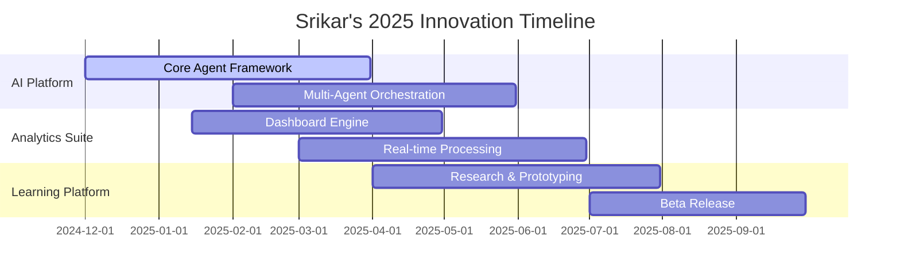

<!-- Profile Banner -->

  

# Hi, I'm Srikar 

AI tinkerer, full‑stack coder, data+product thinker, and lifelong learner.

  

---

## 🚀 About Me

- **🔬 AI + Coding:** I prototype agents, ML workflows, and developer tooling.
- **📚 Education:** I learn in public—notes, experiments, and tiny wins shipped.
- **💼 Business:** Product‑minded; I care about usability, metrics, and outcomes.
- **⚡ Motto:** Ship small, iterate fast, measure impact.

---

## 🛠️ Skills

  
  
  
  
  
  
  
  
  
  
  
  
  
  
  
  

---

## 📌 Featured Projects

- **🔹 [Agentic Dash](https://github.com/Srikar131)** — AI agents + dashboards for data ops.  
- **🔹 [EduNotes](https://github.com/Srikar131)** — spaced‑repetition notes meets code notebooks. 
- **🔹 [ML-lite](https://github.com/Srikar131)** — simple ML templates that actually ship. 

> *Pin repos you want showcased from your profile's "Customize profile" → "Pinned".*

---

## 🎯 What I'm Building Now

### 🚧 **Current Innovation Pipeline** 🚧

<table>
<tr>
<td width="33%" align="center">

**🤖 AI Agent Platform**

*Building autonomous agents that can reason, plan, and execute complex workflows*

**Stack:** LangChain • OpenAI • FastAPI  
**Timeline:** Q1 2025  
**Impact:** 🔥🔥🔥

</td>
<td width="33%" align="center">

**📊 Real-time Analytics Suite**

*Interactive dashboards that tell stories, not just display data*

**Stack:** Next.js • D3.js • WebSockets  
**Timeline:** Q2 2025  
**Impact:** 🔥🔥

</td>
<td width="33%" align="center">

**🎓 Learning Accelerator**

*Spaced repetition meets active recall with AI personalization*

**Stack:** React Native • TensorFlow  
**Timeline:** Q3 2025  
**Impact:** 🔥

</td>
</tr>
</table>

### 🗓️ **Innovation Roadmap**

<strong>🔬 Deep Dive into Current Experiments</strong>

### 🧪 **Lab Notes & Explorations**

**🔬 Active Research Areas:**
- **Agentic AI:** Multi-step reasoning with tool use
- **Micro-Interactions:** UI that feels alive and responsive
- **Learning Sciences:** How humans actually acquire complex skills

**⚡ Quick Wins This Month:**
- ✅ Deployed first autonomous data analysis agent
- ✅ Built interactive SQL query builder with AI assistance
- 🔄 Experimenting with voice-to-code workflows
- 📋 Testing spaced repetition algorithms for technical learning

**🎯 Success Metrics:**
- **User Delight Score:** How much joy does this create?
- **Time to Value:** Minutes from download to "aha moment"
- **Viral Coefficient:** Would users actively recommend this?

---

## 🧩 Holopin Badges

  

---

## ✨ Fun Facts

- **🤖** I automate boring things—then make a dashboard for it.
- **⌨️** Keyboard nerd; dark‑theme everything.
- **🚀** Love shipping small tools that feel delightful.
- **☕** Powered by curiosity and way too much coffee.
- **🎨** Believer that great code is beautiful code.

---

## 🤝 Let's Connect

  
  
  
  

  
  

---

**"Code is poetry, AI is magic, and great products are both."** ✨

*Made with ❤️, AI, and lots of coffee.*

